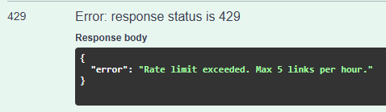
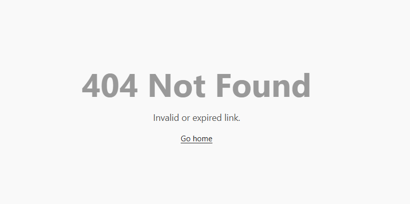

# Linkin — URL Shortener API

A simple URL shortener service with auto-expiry, rate limiting, and a custom 404 page.

---

## 1. Automatic Link Recycling (72-hour inactivity expiry)

Links that haven't been clicked in 72 hours are automatically deleted.

### How it works

A `recycle()` function in [`db.js`](db.js) iterates over every entry in the in-memory cache and deletes it if **either** condition is true:

- The link's hard expiry (1 week after creation) has passed.
- The link hasn't been accessed in the last 72 hours.

If the current time is greater than the expiry or if the time since last accessed is greater than the expiry limit, the entry is deleted from the cache and we update the db file. However, we update the db file only if the cache changed during cleanup.

```js
// db.js
export function recycle() {
  const now = Date.now();
  let changed = false;
  for (const [id, entry] of Object.entries(dbCache)) {
    if (
      now > new Date(entry.expires).getTime() ||
      now - new Date(entry.lastAccessed).getTime() > LAST_ACCESS_LIMIT
    ) {
      delete dbCache[id];
      changed = true;
    }
  }
  if (changed) bufferedSave();
}
```

This function is called on a **1-hour interval** from [`app.js`](app.js):

```js
// app.js
setInterval(recycle, 60 * 60 * 1000);
```

Every time a link is clicked (`GET /:id`), its `lastAccessed` timestamp is updated, effectively resetting the 72-hour inactivity window:

```js
// routes.js — inside GET /:id handler
entry.clicks++;
entry.lastAccessed = new Date().toISOString();
bufferedSave();
```

The `LAST_ACCESS_LIMIT` constant is defined in [`config.js`](config.js):

```js
export const LAST_ACCESS_LIMIT = 72 * 60 * 60 * 1000; // 72 hours in ms
```

---

## 2. Rate Limiting (5 links per hour per IP)

The `POST /shorten` endpoint is rate-limited so a single IP address can create at most 5 shortened URLs per hour.

### How it works

A `rateLimiter` middleware in [`middleware.js`](middleware.js) maintains an in-memory store keyed by IP address. For every request, we check the in-memory store to see if the ip exists, if it doesn't exist we add the ip and increase the request count to 1, we also note the time for the beginning of the window (a window marks the beginning of the one-hour period for which every ip is allowed 5 requests). If the window for the ip making the request has expired (i.e. their previous window began >1 hour ago), we reset the window and their request count. 
- If an IP has exceeded the rate limit we send a 429 response with an error message.
- Otherwise, we simply increase the request count for the IP making the request

```js
// middleware.js
const rateLimitStore = {};

export function rateLimiter(req, res, next) {
  const ip = req.ip;
  const now = Date.now();
  const record = rateLimitStore[ip];

  // First request or window expired — start a new window
  if (!record || now - new Date(record.windowStart).getTime() > RATE_WINDOW_MS) {
    rateLimitStore[ip] = { count: 1, windowStart: new Date().toISOString() };
    return next();
  }

  // Limit exceeded
  if (record.count >= RATE_LIMIT) {
    return res.status(429).json({ error: "Rate limit exceeded. Max 5 links per hour." });
  }

  // Within window and under limit
  record.count++;
  next();
}
```

The middleware is applied **only** to the shorten route in [`routes.js`](routes.js):

```js
router.post("/shorten", rateLimiter, (req, res) => { ... });
```

Because the app was deployed on Railway, `trust proxy` is enabled so `req.ip` returns the real client IP rather than the proxy's:

```js
// app.js
app.set("trust proxy", true);
```

The limits are configured in [`config.js`](config.js):

```js
export const RATE_LIMIT = 5;                      // max requests per window
export const RATE_WINDOW_MS = 60 * 60 * 1000;     // 1 hour
```

### What it looks like



---

## 3. Custom 404 Page for Expired or Deleted Links

When a user visits a short URL that doesn't exist or has expired, they see a styled HTML page instead of a raw JSON error.

### How it works

The `GET /:id` and `GET /:id/stats` handlers in [`routes.js`](routes.js) check whether the entry exists and hasn't expired. If the link is missing or expired, Express serves the [`not-found.html`](not-found.html) file with a 404 status:

```js
// routes.js
if (!entry || Date.now() > new Date(entry.expires).getTime()) {
  if (entry) delete dbCache[req.params.id]; // clean up expired entry
  return res.status(404).sendFile(path.join(__dirname, "not-found.html"));
}
```

The HTML page in [`not-found.html`](not-found.html) is a minimal page that shows.

- A large **404** heading
- A message: "Invalid or expired link."
- A link back to the home page

```html
<body>
  <h2>404 Not Found</h2>
  <p>Invalid or expired link.</p>
  <a href="/">Go home</a>
</body>
```

### What it looks like


